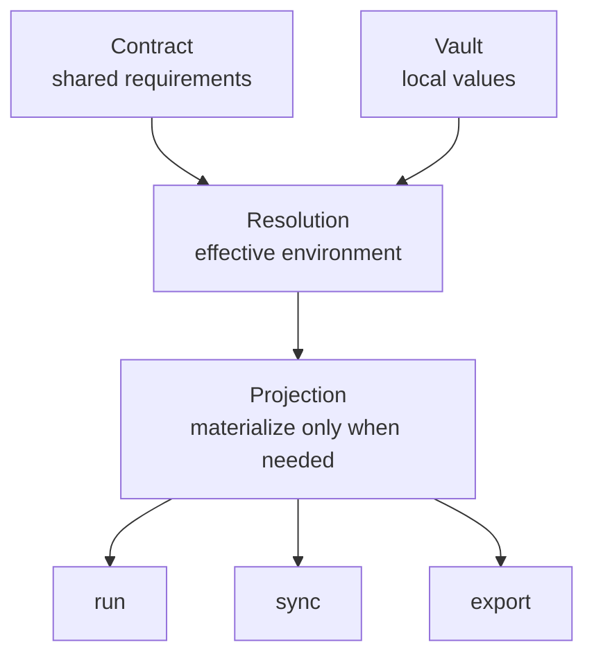

# Concepts

This is the mental model behind `envctl`.

If the model is clear, the commands make sense.
If the model is fuzzy, everything feels more magical than it should.

-   :material-file-document-outline:{ .lg .middle } **Contract**

    The shared definition of what the environment must contain.

    [Read about contracts](contract.md)

-   :material-shield-lock-outline:{ .lg .middle } **Vault**

    Local values live outside version control, where they belong.

    [Read about the vault](vault.md)

-   :material-layers-triple-outline:{ .lg .middle } **Profiles**

    Separate contexts cleanly without duplicating fragile files.

    [Read about profiles](profiles.md)

-   :material-source-branch:{ .lg .middle } **Resolution**

    Understand which value wins, and why.

    [Read about resolution](resolution.md)

-   :material-export:{ .lg .middle } **Projection**

    Learn how values are materialized only when needed.

    [Read about projection](projection.md)

-   :material-identifier:{ .lg .middle } **Binding**

    Understand how a repository checkout reconnects to the right local project state.

    [Read about binding](binding.md)

-   :material-database-marker-outline:{ .lg .middle } **Metadata and local state**

    See how local operational metadata supports recovery without becoming the source of truth.

    [Read about metadata](metadata.md)

## The short version

`envctl` is not just a CLI for shuffling `.env` files around.

It gives you:

- a contract for shared intent
- a vault for local truth
- profiles for context
- deterministic resolution
- explicit projection

## The model in one view

The important thing to see here is that `resolution` sits in the middle.

The contract defines shared requirements. The vault contributes local state. Projection happens only after resolution has decided what is actually true.

