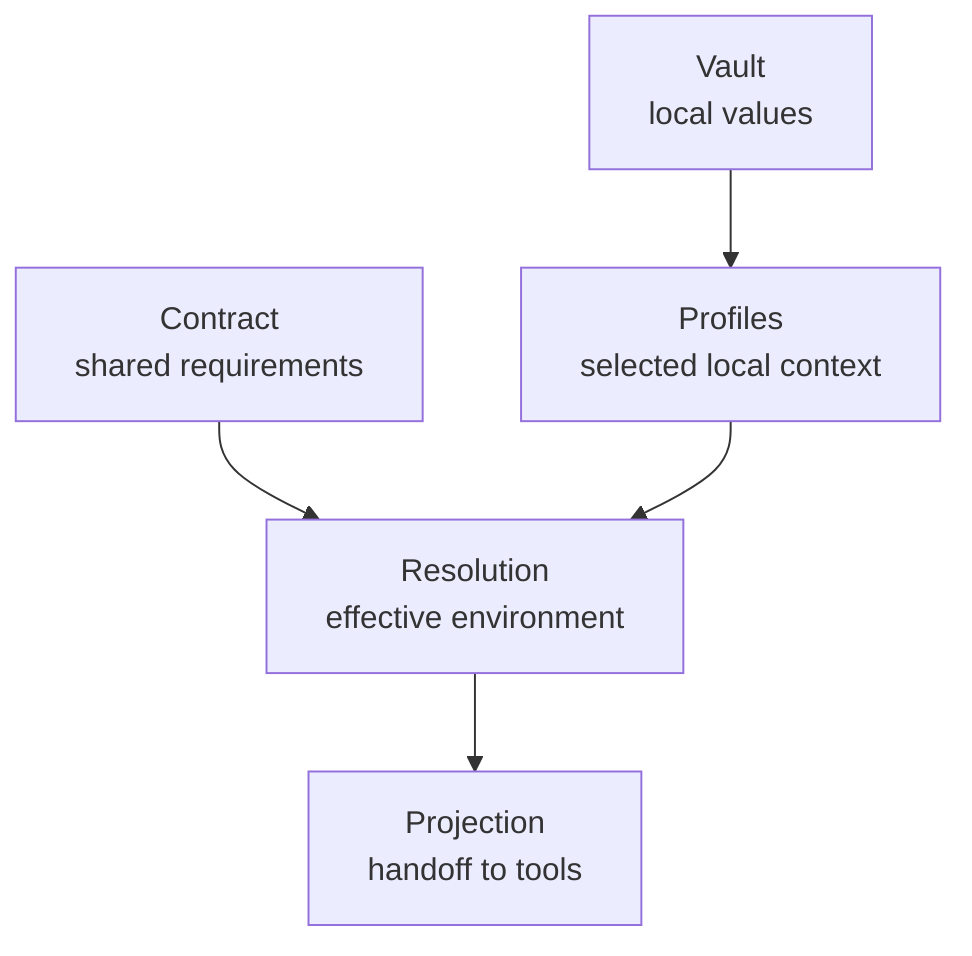

# Concepts

  Concepts
  

    This section contains the canonical definitions of the <code>envctl</code> model.
    Use it when you want to understand what a layer means, what it does not mean, and how it fits into the whole system.
  

## When to use this section

Use Concepts when your question sounds like:

- what is a contract
- what role does the vault play
- what does resolution mean
- how is projection different from resolution

If your question is instead “how do I do this workflow?”, go to [Guides](../guides/index.md). If you need exact command behavior, go to [Reference](../reference/index.md).

## The model in one view

## Concept map

-   :material-file-document-outline:{ .lg .middle } **Contract**

    The shared definition of what the project environment must contain.

    [Read about the contract](contract.md)

-   :material-shield-lock-outline:{ .lg .middle } **Vault**

    The local storage layer for real values and secrets.

    [Read about the vault](vault.md)

-   :material-layers-triple-outline:{ .lg .middle } **Profiles**

    Multiple local contexts for the same contract.

    [Read about profiles](profiles.md)

-   :material-source-branch:{ .lg .middle } **Resolution**

    How `envctl` determines what is true for one run.

    [Read about resolution](resolution.md)

-   :material-export:{ .lg .middle } **Projection**

    How resolved truth reaches a runtime or generated artifact.

    [Read about projection](projection.md)

-   :material-identifier:{ .lg .middle } **Binding**

    How a checkout reconnects to the correct local project state.

    [Read about binding](binding.md)

-   :material-database-marker-outline:{ .lg .middle } **Metadata and local state**

    Supporting local metadata that must not become the source of truth.

    [Read about metadata](metadata.md)

-   :material-source-commit:{ .lg .middle } **Hooks**

    The narrow safety role of envctl-managed Git hooks.

    [Read about hooks](hooks.md)

## Read next

### Contract

Start with the shared definition layer.

[Read about the contract](contract.md)

### Resolution

Jump to the point where the model becomes concrete for one run.

[Read about resolution](resolution.md)

### Guides

Move from definitions into real workflows.

[Open guides](../guides/index.md)

