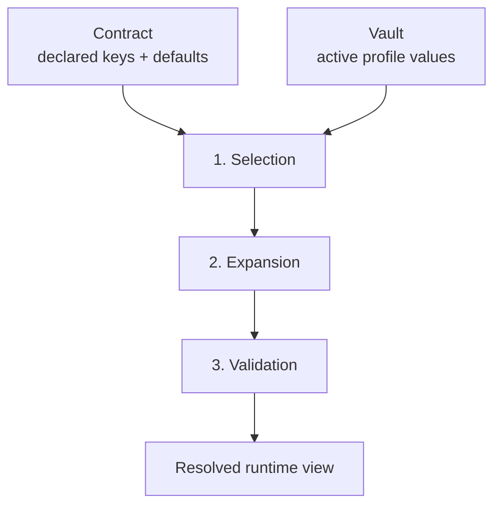

# Resolution

Resolution is how `envctl` decides what value each variable actually has at runtime.

If the contract says what should exist, resolution answers the next question:

> what is the effective value right now, and why?

That makes resolution the bridge between shared intent and usable runtime state.

!!! important "Resolution does not read arbitrary host environment variables"
    Resolution only uses declared contract data, active profile values, and contract defaults. It does not silently pull undeclared shell state into the model.

## TL;DR

Resolution is where `envctl` combines the contract with local vault state and decides the effective environment.

- The contract defines what must exist and what defaults are allowed.
- The vault supplies local values for the active profile.
- Resolution is deterministic: it does not quietly read arbitrary host shell state.
- Projection only happens after resolution succeeds.



## What resolution is

Resolution is the process that turns:

* contract declarations
* active profile values
* contract defaults

into one validated runtime view.

It is where `envctl` stops being a storage model and becomes an executable environment model.

## What resolution is not

Resolution is not:

* projection
* file generation
* shell inheritance magic
* “whatever the current host environment happens to contain”

If something is not declared in the contract or selected by the resolution rules, it does not quietly appear just because it exists in your shell.

## The observable flow

At a high level, resolution does three things:

```text
selection
-> expansion
-> validation
```

That is the flow you should keep in your head when debugging.

## 1. Selection

Selection decides the raw value source for each variable.

The effective order is:

```text
active profile values
-> contract defaults
```

That means:

* local values in the active profile win first
* if a value is not present there, the contract may provide a default
* arbitrary host process variables do not participate in selection

This is one of the places where `envctl` becomes easier to reason about than ad hoc dotenv conventions.

## 2. Expansion

After selection, `envctl` resolves supported placeholders inside the chosen raw values.

In v1, the supported placeholder form is:

```text
${VAR}
```

That means:

* `${VAR}` is meaningful
* `$VAR` stays literal
* malformed placeholders are invalid

### Contract-only expansion

Expansion is contract-only.

If a value references `${VAR}`:

* `VAR` must be a declared contract key
* that referenced key is resolved through the same model
* if the referenced key has no selected value, resolution becomes invalid
* if the placeholder points to an unknown key, resolution becomes invalid

This is deliberate. It avoids hidden dependence on arbitrary machine state.

So an expression like `${HOME}` is only valid if `HOME` is part of the contract.

## 3. Validation

Once selection and expansion have produced an effective value, resolution validates the result against the contract.

Typical checks include:

* missing required values
* placeholder syntax and reference validity
* type correctness
* declared formats such as `json`, `url`, or `csv`
* allowed choices
* patterns

So resolution is not just “pick a value”. It is “pick a value and confirm it still makes sense”.

## What the output looks like

The output of resolution is one resolved environment:

* values are selected
* placeholders are expanded
* invalid states are surfaced
* the result is ready to inspect, validate, or project

This is the state that commands like `check`, `inspect`, `run`, `sync`, and `export` work from.

## What resolution makes observable

A good resolution model should make these questions answerable:

* where did this value come from?
* was a default used?
* did a placeholder chain resolve cleanly?
* why did this variable fail validation?
* why did projection get blocked?

That is why resolution matters so much to the product. It is where “environment configuration” becomes something you can reason about instead of guess.

## Common failure modes

Resolution usually fails in a few predictable ways:

* a required variable has no selected value
* a placeholder points to an undeclared key
* a placeholder references a key that also cannot resolve
* a value exists but fails type or format validation
* a user expects host environment inheritance that the model does not allow

These failures are useful because they reveal bad assumptions early.

## Why there is no magic

`envctl` is deliberately conservative here.

It does not quietly:

* inherit undeclared shell variables into resolution
* invent values to make a command pass
* let one profile bleed into another
* let groups redefine how expansion works

That strictness is the reason the system stays explainable.

## Relation to selectors

Selectors such as `--group`, `--set`, and `--var` change the active scope a command is concerned with.

They do not change the basic resolution model itself.

That distinction matters: selection affects what output or validation target you asked for, but expansion still follows contract-defined references.

## Why this matters

When resolution is explicit:

* debugging gets faster
* CI becomes more trustworthy
* local workflows stop depending on hidden machine quirks
* projection outputs stop feeling mysterious

In short, resolution answers:

> given the contract and my selected local state, what is actually true right now?

## Read next

Move from the runtime model to the places where it becomes visible:

<div class="grid cards envctl-read-next" markdown>

-   **Projection**

    See how resolved state is handed to a process, file, or stdout.

    [Read about projection](projection.md)

-   **check**

    Use the fast diagnostic path when you want a short readiness answer.

    [Open the `check` command](../reference/commands/check.md)

-   **inspect**

    Use the deeper diagnostic path when you need to understand one value.

    [Open the `inspect` command](../reference/commands/inspect.md)

</div>
