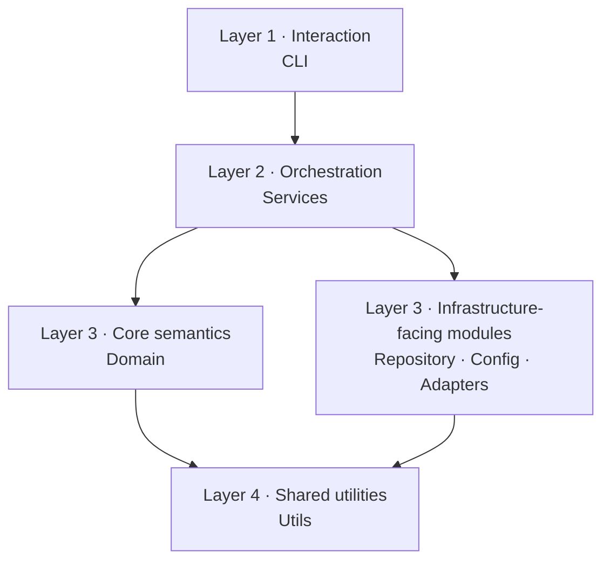

# Internal Architecture

  Advanced reference
  

    This page is for maintainers and contributors who need the repository’s current implementation shape, not just the conceptual layer model.
    It explains what the codebase owns today and which dependency rules are expected to stay intact.
  

## Product model first

`envctl` revolves around a small set of concepts:

- **contract** — the shared project declaration discovered from `.envctl.yaml` first, then `.envctl.schema.yaml` as legacy fallback
- **profile values** — local persisted values stored in the vault
- **project context** — the resolved project identity, binding source, and vault paths
- **resolution** — the deterministic runtime view built from contract and profile values
- **inspection** — human or JSON diagnostics over resolved state
- **projection** — safe export of resolved values to subprocesses or generated files

The implementation should reinforce that model instead of hiding it.

## Layering

The repository is intentionally split into a small set of layers with directed dependencies:

## Dependency rules

Dependencies must always point inward or downward in the architecture. No layer may depend on a layer above it.

### Allowed dependencies

| Layer | May depend on |
| --- | --- |
| CLI | services, domain, config, utils |
| services | domain, repository, adapters, config, utils |
| repository | domain, adapters, config, utils |
| adapters | domain, config, utils |
| domain | utils |
| config | utils |
| utils | standard library and external libraries only |

### Forbidden dependencies

- `domain` must not import services, repository, adapters, CLI, or config
- `adapters` must not import services, repository, or CLI
- `repository` must not import services or CLI
- `services` must not import CLI
- `utils` must not import CLI, services, or repository
- `config` must not import CLI, services, or repository

## CLI shape

The CLI is being normalized around one command pattern:

1. read Typer arguments and options
2. normalize or validate CLI-only combinations
3. call one service workflow
4. choose JSON or terminal output

That boundary keeps interaction rules separate from orchestration and formatting.

## Read next

### Layers

Go back to the lighter conceptual explanation of what each layer owns.

[Read about layers](../architecture/layers.md)

### Migration and compatibility

Open this when current behavior is shaped by legacy rules.

[Read migration and compatibility](compatibility.md)

### Boundaries

Reconnect implementation rules to the product boundaries they protect.

[Read about boundaries](../architecture/boundaries.md)

