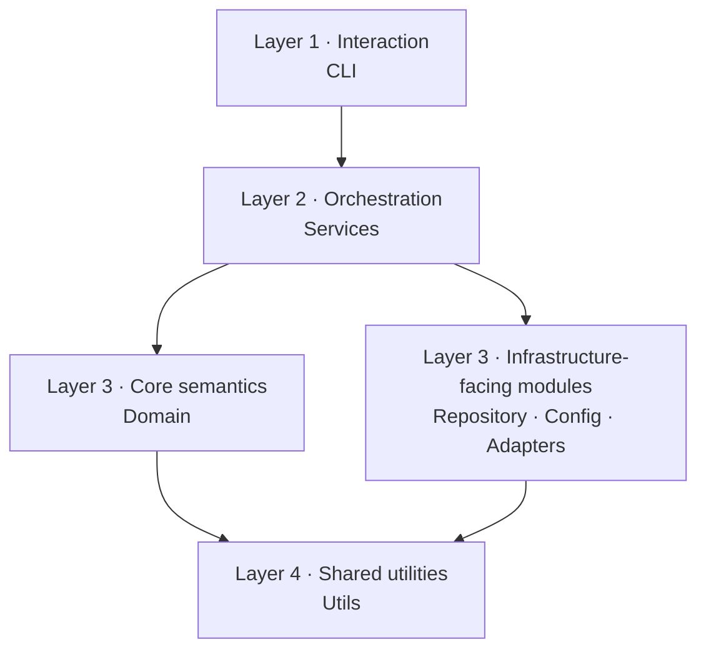
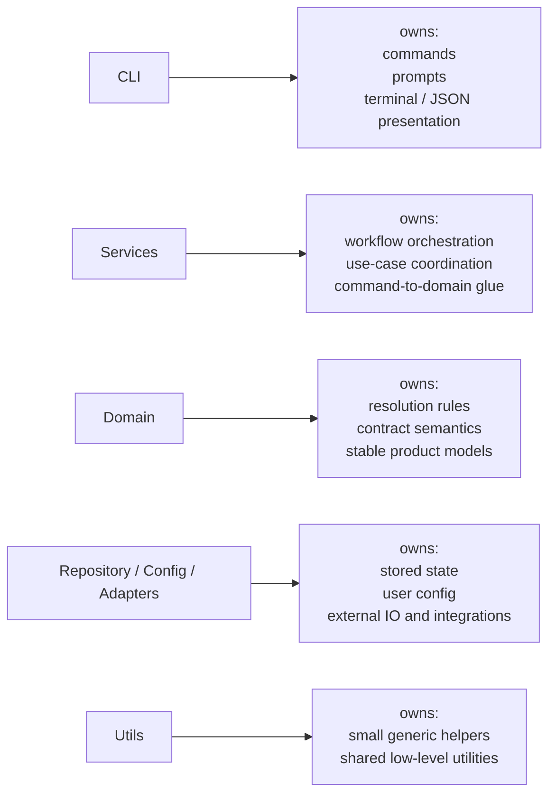
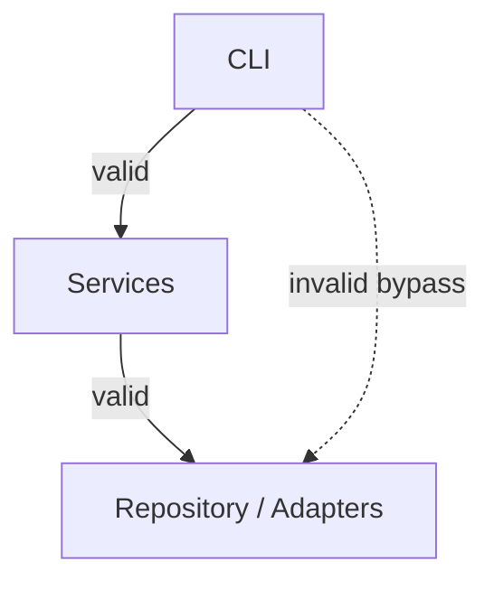

# Internal Architecture

This document explains how `envctl` is organized internally today.

It is written for maintainers and contributors. The goal is not to describe an ideal architecture in the abstract, but the actual structure of this repository and the responsibilities each layer is expected to keep.

## Product model first

`envctl` revolves around a small set of concepts:

* **contract** — the shared project declaration discovered from `.envctl.yaml` first, then `.envctl.schema.yaml` as legacy fallback
* **profile values** — local persisted values stored in the vault
* **project context** — the resolved project identity, binding source, and vault paths
* **resolution** — the deterministic runtime view built from contract + profile values
* **inspection** — human or JSON diagnostics over resolved state
* **projection** — safe export of resolved values to subprocesses or generated files

The code should reinforce that model.

## Layering

The repository is intentionally split into a small set of layers with directed dependencies:

The CLI talks to services. Services orchestrate workflows. The deeper layers should not depend on Typer or presentation concerns.

### Layer responsibilities

This second view is not about dependency direction.

It is about ownership: what kind of work belongs in each layer, and what kind of work should be pushed elsewhere.

## Dependency Rules (Architecture Contract)

The layering described above is not only conceptual. It defines strict dependency rules.

Dependencies must always point inward or downward in the architecture.
No layer may depend on a layer above it.

These rules are about architectural ownership, not about denying all transitive reachability.
For example, CLI code is expected to call services that in turn use repository and adapters.
That is valid.

The architectural concern is with direct layer bypasses and misplaced responsibilities.

### Allowed dependencies

| Layer      | May depend on                                |
| ---------- | -------------------------------------------- |
| CLI        | services, domain, config, utils              |
| services   | domain, repository, adapters, config, utils  |
| repository | domain, adapters, config, utils              |
| adapters   | domain, config, utils                        |
| domain     | utils (discouraged, keep minimal)            |
| config     | utils                                        |
| utils      | standard library and external libraries only |

### Forbidden dependencies

The following are explicitly disallowed:

* `domain` must not import:

  * services
  * repository
  * adapters
  * CLI
  * config

* `adapters` must not import:

  * services
  * repository
  * CLI

* `repository` must not import:

  * services
  * CLI

* `services` must not import:

  * CLI

* `utils` must not import:

  * CLI
  * services
  * repository

* `config` must not import:

  * CLI
  * services
  * repository

### Directional constraint

The following dependency direction is intentional and must be preserved:

* `repository → adapters` is allowed
* `adapters → repository` is forbidden

This enforces a one-way infrastructure dependency and avoids circular coupling.

### Design intent

These rules are enforced to ensure:

* domain remains pure and stable
* services remain orchestration-only
* adapters remain infrastructure-only
* repository does not become a hidden service layer
* CLI remains a thin interaction layer

Violations of these rules should be treated as architectural bugs, not convenience shortcuts.

## CLI

The CLI layer owns:

* Typer commands
* argument and selector validation
* command-specific output choices
* alias and deprecation messaging

Examples in this repo:

* `check` is a compact validation command
* `inspect` is the detailed diagnostic command
* `inspect KEY` is the focused single-variable view
* `doctor` and `explain` are deprecated aliases that delegate to `inspect` and `inspect KEY`

The CLI should stay thin. If a command starts accumulating diagnostic-building logic, that logic probably belongs in a reusable service-level workflow helper or in a shared pure module, depending on whether it expresses orchestration or stable semantics.

Interactive terminal behavior also belongs to the CLI layer.
That includes confirmations, user-facing prompts, and other command-line interaction helpers.
Those should not live in adapters or repository code.

## Canonical CLI command shape

The CLI is being normalized around one canonical command pattern.

A command should usually do only four things:

1. read Typer arguments and options
2. normalize or validate CLI-only combinations
3. call one service workflow
4. choose JSON or terminal output

That means command modules should prefer a structure like this:

* `_normalize_*` helpers for Typer-specific booleans or option cleanup
* `_validate_*` helpers for mutually exclusive CLI arguments
* one or more `_handle_*` helpers for command modes
* shared helpers from `envctl.cli.command_support` for warning rendering and JSON payload construction

The important boundary is this:

* **CLI** owns interaction rules, routing, and presentation choice
* **Services** own workflow orchestration and compatibility data that is not tied to Typer itself
* **Presenters / serializers** own formatting

Examples of logic that should move out of command modules:

* compatibility warning construction for deprecated alias commands
* compatibility doctor check building
* reusable JSON payload assembly
* reusable command warning aggregation

Examples of logic that should stay in command modules:

* deciding that `inspect KEY` cannot be combined with `--group`
* deciding whether a command is in JSON or text mode
* choosing which presenter to call for one view

This keeps commands thin without introducing an over-engineered command framework.

## Services

Services coordinate workflows and return structured results to the CLI.

Important examples in this repo:

* `resolution_service` builds the resolved runtime state
* `check_service` returns a compact `CheckResult`
* `inspect_service` returns `InspectResult` or `InspectKeyResult`
* `resolution_diagnostics.py` converts a `ResolutionReport` into reusable problems and summaries
* projection-related services enforce that invalid or unsafe state does not leak into `run`, `sync`, or `export`

A service should not know how the terminal output is formatted.

Services may use pure domain helpers, repository access, and adapters, but they should not become a dumping ground for reusable pure logic that belongs in the domain.
If a helper expresses contract semantics rather than workflow orchestration, it likely belongs outside services.

## Domain

The domain layer defines the core concepts and stable result models.

Examples:

* `Contract`, `VariableSpec`, `SetSpec`, and the resolved contract graph model used by inspect
* `ProjectContext`
* `ResolutionReport` and `ResolvedValue`
* `CheckResult`, `InspectResult`, `InspectKeyResult`, `DiagnosticProblem`, and `DiagnosticSummary`

This is the layer where semantics should live. If a concept matters to users or to the product model, it probably deserves a domain model instead of an ad-hoc dictionary.

## Repository

The repository layer reconstructs persisted project state and contract state.

Examples:

* discovering the root contract at the repository root
* loading and validating individual contract files
* resolving imported contract graphs and composing one resolved contract view
* resolving vault profile paths
* reconstructing project binding and recovery state
* reading and writing persisted local state

This layer answers questions like “what exists on disk?” and “what project does this repo belong to?”

Repository code may compose and reconstruct persisted state, but it must not depend on service-layer orchestration helpers.
If repository code needs pure contract semantics, that logic belongs in domain models or other explicitly shared pure modules, not in services.

## Config

The config layer deals with user-level tool configuration:

* runtime mode
* default profile
* encryption settings
* config file validation

This is not project contract state. It is local tool configuration.

## Adapters

Adapters isolate external integrations and file-format specifics.

Examples:

* dotenv parsing and rendering
* git access
* editor launching
* filesystem, process-environment, and external tool integration helpers

Adapters should keep those concerns from leaking into services or domain code.

Interactive terminal prompts and confirmation flows belong to the CLI layer, not to adapters.

## Utils

Utilities exist for narrow, reusable helpers such as:

* atomic writes
* masking
* filesystem helpers
* path normalization

`utils` should stay small and boring. If meaningful business logic starts to accumulate there, the code is probably hiding a missing domain or service concept.

Utilities should remain generic and low-level. Output formatting, persistence logic, and external integrations do not belong here.

## Error and diagnostics model

`envctl` does not only return success values. It also exposes structured diagnostics.

There are two important families:

* **structured errors** — config, contract, repository, state, and projection failures surfaced through diagnostics objects
* **command diagnostics** — summaries and actionable problems returned by `check` and `inspect`

That separation matters:

* structured errors explain why a command could not proceed
* command diagnostics explain the state that was inspected successfully but needs action

## Current transition state

The repo is in a controlled transition around diagnostics commands.

The intended model is:

* `check` = short validation
* `inspect` = full diagnostics
* `inspect KEY` = one variable in detail
* `doctor` = deprecated alias of `inspect`
* `explain` = deprecated alias of `inspect KEY`

Compatibility shims still exist in a few places, especially for legacy JSON fields and alias behavior. Those should be treated as transitional, not as the target architecture.

## What to avoid

The main anti-patterns in this repo are:

* business logic inside CLI commands
* new command behavior implemented by reviving legacy presenters
* growing compatibility payloads without explicit removal plans
* hiding reusable diagnostic logic inside one command service instead of shared builders
* placing pure reusable semantics in services just because the first caller happens to be a service

## Practical summary

A good way to read the current architecture is:

* CLI chooses the interaction shape
* services orchestrate workflows
* domain defines stable semantics
* repository reconstructs persisted project state
* config manages local tool settings
* adapters isolate external systems
* utils support, but should not lead

That is the structure that should guide future work on `envctl`.
